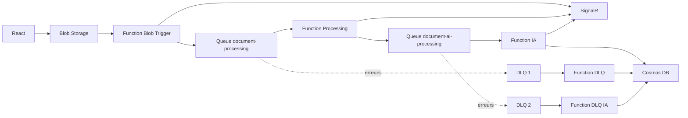

# Mini-projet Azure - Pipeline asynchrone

Projet de traitement de documents avec Azure Functions, Service Bus, Cosmos DB, SignalR et IA (tagging).

## Objectif

A partir d'un upload de fichier, le pipeline doit:

1. envoyer un message dans Service Bus,
2. traiter le document (IA + mise a jour Cosmos),
3. notifier le front React en temps reel,
4. gerer les erreurs via DLQ.

## Architecture

- React upload un fichier dans Blob Storage
- `BlobToServiceBus` (Blob Trigger):
  - extrait les infos (`documentId`, `fileName`, `blobName`, `size`)
  - envoie un message dans la queue `document-processing`
  - notifie `UPLOADED`
  - met le statut `QUEUED` dans Cosmos
- `ServiceBusWorker` (Queue Trigger `document-processing`):
  - notifie `PROCESSING`
  - met le statut `PROCESSING`
  - relaye le message vers `document-ai-processing`
- `AiProcessingWorker` (Queue Trigger `document-ai-processing`):
  - genere des tags avec Azure AI Language
  - met a jour Cosmos en `PROCESSED`
  - notifie `PROCESSED` avec les tags
- DLQ:
  - `DlqAlertFunction` lit `document-processing/$DeadLetterQueue`
  - `AiDlqAlertFunction` lit `document-ai-processing/$DeadLetterQueue`
  - statut `ERROR` + notification

### Schema simple

## Files et queues attendues

- Blob container/path d'entree: `doc-storage/input/{documentId}/{fileName}`
- Queues Service Bus:
  - `document-processing`
  - `document-ai-processing`

## Tests manuels

### 1) Fichier valide -> PROCESSED

- Uploader un PDF/JPG/PNG/DOCX non vide.
- Verifier:
  - notifications React: `UPLOADED -> PROCESSING -> PROCESSED`
  - Cosmos: statut final `PROCESSED` + `tags`
  - les messages sont consommes dans les 2 queues.

### 2) Fichier vide -> ERROR

- Uploader un fichier 0 octet.
- Verifier:
  - notification `ERROR`
  - Cosmos: statut `ERROR`.

### 3) Extension non supportee -> ERROR

- Uploader un fichier non autorise (ex: `.txt`).
- Verifier:
  - notification `ERROR`
  - Cosmos: statut `ERROR`.

### 4) Message invalide -> DLQ

- Envoyer manuellement un message invalide dans `document-processing`.
- Verifier:
  - apres retries, message en DLQ
  - `DlqAlertFunction` est declenchee
  - statut `ERROR` (si `documentId` disponible).

### 5) Echec IA repete -> DLQ

- Provoquer une erreur IA (cle ou endpoint invalide).
- Verifier:
  - retries sur `document-ai-processing`
  - message en DLQ
  - `AiDlqAlertFunction` est declenchee.

## Statuts metier

`CREATED -> UPLOADED -> QUEUED -> PROCESSING -> PROCESSED`

En cas d'erreur: `ERROR`